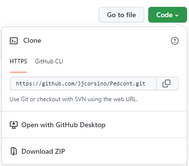
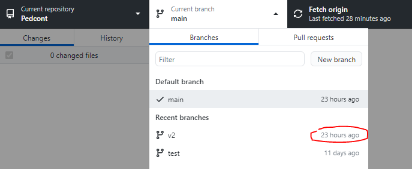

<div id="top"></div>


<!-- PROJECT LOGO -->
<br />
<div align="center">
 
   

<h3 align="center"></h3>
  

  <p align="center">
    Esta proyecto fue creado solamente para fines practicos. La idea principal es poder tener todo el contenido de pedco para cuando se caiga la pagina, asi como notas, graficos, etc.
    <br />
    
  </p>
</div>


<!-- TABLE DE CONTENIDOS -->
<details>
  <summary>Tabla de contenidos</summary>
  <ol>
    <li>
      <a href="#about-the-project">Sobre el proyecto</a>
      <ul>
        <li><a href="#built-with">Tecnologias</a></li>
      </ul>
    </li>
    <li>
      <a href="#getting-started">Como empezar</a>
      <ul>
        <li><a href="#prerequisites">Prerequisitos</a></li>
        <li><a href="#installation">Instalacion</a></li>
      </ul>
    </li>
    <li><a href="#roadmap">Roadmap</a></li>
    <li><a href="#contributing">Contribuciones</a></li>
    <li><a href="#license">Licencia</a></li>
    <li><a href="#contact">Contacto</a></li>
  </ol>
</details>


<!-- Sobre el proyecto -->
## Sobre el proyecto

La idea principal del proyecto es poder acceder a los datos de las materias sin depender de pedco. Al mismo tiempo se utiliza para poder practicar tecnologias
o aprender a desarrollar por primera vez.

<p align="right">(<a href="#top">Volver arriba</a>)</p>


### Construido con

* [HTML](https://html.com/)
* [CSS](https://google.com/)
* [JavaScript](https://javascript.com/)
  * [ChartJs](https://www.chartjs.org/)
  * [ChartJs-plugin-label](https://github.com/DavideViolante/chartjs-plugin-labels)
* [Power BI](https://powerbi.microsoft.com/)


<p align="right">(<a href="#top">Volver arriba</a>)</p>


<!-- Como empezar -->
## Como empezar

Esto es un mini tutorial para los que quieran unirse al proyecto y aun no sepan "nada.<br>
Si siguen los pasos no van deberian tener ningun problema. (Resumido para gente de boquita)

<p align="right">(<a href="#top">Volver arriba</a>)</p>

### Prerequisitos

* Crearse o tener cuenta en [GitHub](https://github.com/)
* Tener algun IDE (Visual Studio Code recomendado) [VSC](https://code.visualstudio.com/)
* Bajarse [GithubDesktop](https://desktop.github.com/)

<p align="right">(<a href="#top">Volver arriba</a>)</p>

### Instalacion

Al tener los requisitos previos ya se puede empezar. Avisarme por ds (Newhunterino#4842) para la integración al proyecto.<br>

* Al ser un proyecto web simple, por ahora, no van a necesitar instalar dependencias.


1. * Clonar el repositorio (comandos).

   ```sh
   git clone https://github.com/Jjcorsino/Pedcont
   ```
   * o desde la web para la gente de bokita
   
   ```sh
   boton verde -> Open with Github Desktop
   ```

2. * Una vez abierto el repositorio desde Github Desktop, dirigirse a la branch v2 o test
  
  ```sh
   Van a salir varias opciones. --> 'open in visual studio code'
   ```
3. * Una vez abierta la branch v2, pueden empezar a tocar cosas.


##No dar push ni crear pull request sin avisar, traten de no romper nada

<p align="right">(<a href="#top">Volver arriba</a>)</p>


<!-- ROADMAP -->
## Roadmap

<b>Aca se expone una mini lista de las cosas que hay que modificar o agregar a la página de pedcon't:</b>

- [x] Pantalla para llevar información power bi
- [x] Cuenta regresiva para la fecha de los parciales
  - [ ] Agregar función de tachar los parciales automaticamente si la fecha ya paso
  - [x] Poner todas las fechas en el Js
- [ ] Cambiar el estilo del css
  - [x] Subir 'Fechas Importantes' arriba de las noticias derechas
- [x] Agregar contenido de las materias
  - [x] Algebra
  - [x] Resolución de problemas y algoritmos
  - [x] Modelos y sistemas de la información
  - [x] Introducción a la computación
- [ ] Agregar pantalla para cada una de las materias
- [x] Agregar menu navegación
  - [x] Agregar constrante al nav
  - [ ] Agregar Fechas Importantes al nav
- [x] Agregar fechas parciales
- [ ] Analizar datos de los graficos con Pandas py
- [x] Modo oscuro
  - [ ] Acomodar el modo oscuro para que funcione correctamente
- [x] Pasar graficos a Chartjs
  - [x] Primera prueba
  - [x] Segunda prueba
  - [ ] Actualizar font-size dentro de los graficos y cambiar color
- [x] Pantalla para datos de las materias
  - [x] Corregir boton 'Ver más'
- [ ] Cambiar 'Contenido materias' por algo útil, PE: noticias viejas
- [ ] Implementar API Pedco Status

* Actualizar readme si implementan algo


<p align="right">(<a href="#top">Volver arriba</a>)</p>


<!-- CONTRIBUCIONES-->
## Contribuir

<b>Si quieren contribuir por primera vez, avisenme en discord y explico con un mini tutorial, si no son de bokita --> </b>
1. Fork the Project
2. Crear una rama con tus cambios (`git checkout -b feature/Pedco-n't`)
3. Enviar tus cambios (`git commit -m 'Add some Pedco-n't'`)
4. Push la rama (`git push origin feature/Pedco-n't`)
5. Abrir una Pull Request
6. blablaba

<p align="right">(<a href="#top">Volver arriba</a>)</p>


<!-- LICENCIA -->
## Licencia

No hay licencia pa, todo free. Usalo como quieras

<p align="right">(<a href="#top">Volver arriba</a>)</p>


<!-- CONTACTo -->
## Contacto

Project Link: [https://github.com/Jjcorsino/Pedcont](https://github.com/Jjcorsino/Pedcont)<br>
Github Pages: [https://jjcorsino.github.io/Pedcont/](https://jjcorsino.github.io/Pedcont/)<br>
Discord: Newhunterino#4842<br>
Github Profile: [Profile](https://github.com/Jjcorsino/)<br>

<p align="right">(<a href="#top">Volver arriba</a>)</p>
